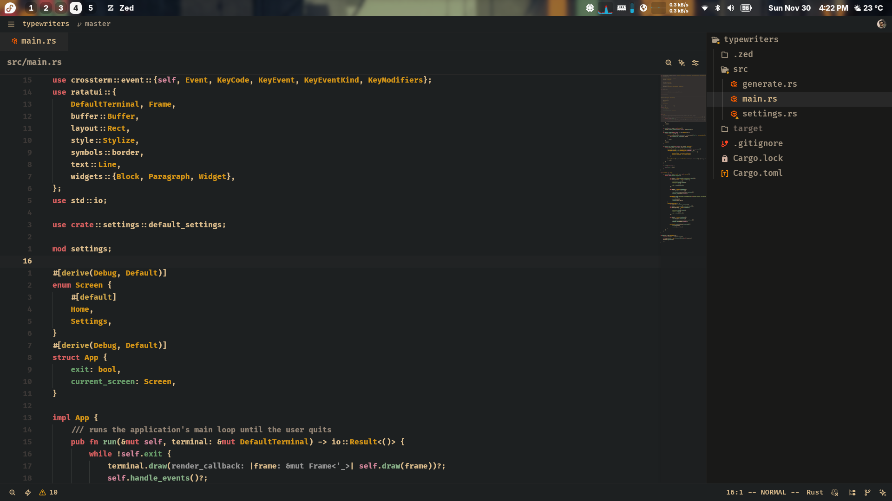
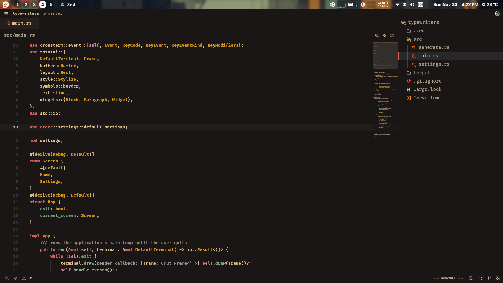

# Gruvbox Mod Dark

A carefully crafted dark theme for [Zed](https://zed.dev/) inspired by the beloved Gruvbox color scheme. This theme offers a warm, retro groove with carefully selected colors that provide excellent contrast and reduce eye strain during long coding sessions.

## 🎨 Color Palette

This theme features a rich, earthy color palette built around these key colors:

- **Background**: `#1d2021` - Deep dark brown for comfortable viewing
- **Foreground**: `#dfbf8e` - Warm cream for primary text
- **Accent**: `#d75f5f` - Muted red for highlights and focus elements
- **Muted Text**: `#a89984` - Subtle gray-brown for secondary information
- **Borders**: `#282828` - Dark borders that don't distract

### Syntax Highlighting Colors:

- **Strings**: `#8b9553` - Muted green
- **Keywords**: `#d75f5f` - Soft red
- **Numbers**: `#d69617` - Warm orange
- **Comments**: `#a89984` - Subtle gray
- **Types**: `#458588` - Calming blue
- **Functions**: `#dfbf8e` - Cream accent

## 📸 Screenshots

### Gruvbox Mod Dark

### Gruvbox Mod Dark (Darker Variant)

## 🚀 Installation

1. Download or clone this repository
2. Copy the theme files to your Zed themes directory
3. Open Zed settings and select "Gruvbox Mod Dark" from the theme picker

## ✨ Features

- **Eye-friendly**: Warm colors that reduce eye strain
- **High contrast**: Carefully balanced colors for excellent readability
- **Consistent**: Unified color scheme across all UI elements
- **Terminal support**: Full ANSI color support for integrated terminal
- **Multiple variants**: Choose between standard and darker versions

## 🙏 Acknowledgments

Special thanks to:

- **[tristan-f-r](https://github.com/tristan-f-r/zed-gruvbox-ish)** - Original creator of the zed-gruvbox-ish theme that this project was forked from
- **[morhetz](https://github.com/morhetz/gruvbox)** - Creator of the original Gruvbox color scheme
- The entire Gruvbox community for keeping this timeless aesthetic alive

## 📝 License

This theme builds upon the excellent work of the original Gruvbox theme and zed-gruvbox-ish. Please refer to their respective licenses for usage terms.

---

_Made with ❤️ for the Zed community_
