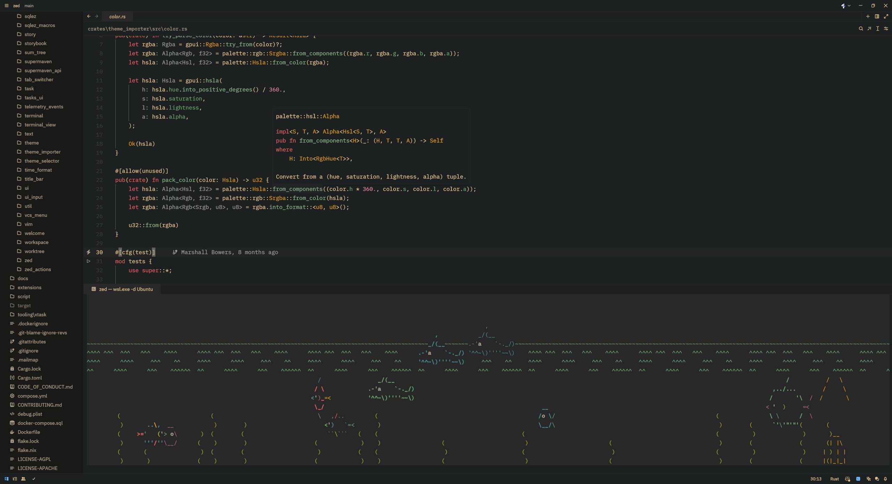
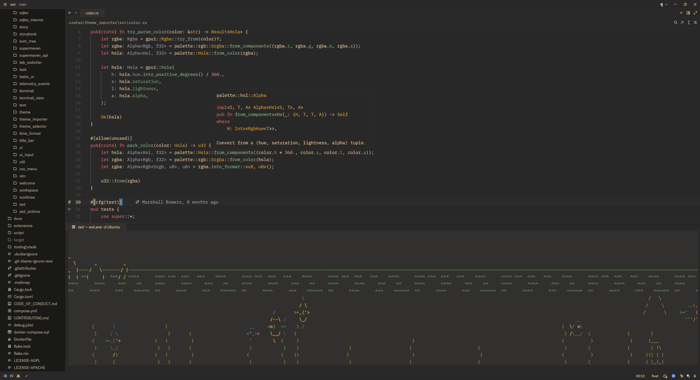
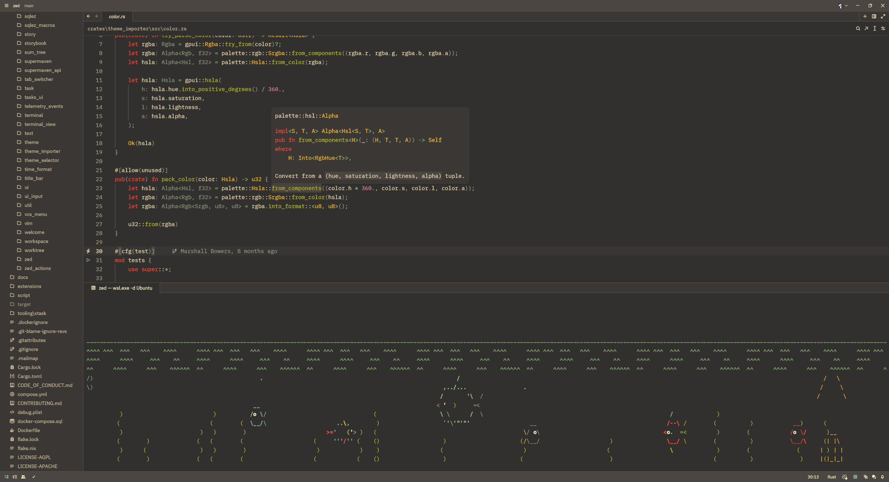

# zed-gruvbox-ish

[zed](https://zed.dev/) port of [gruvbox-ish](https://github.com/graceful-potato/gruvbox-ish), my favorite theme.

## Theme Variants

### Gruvbox ish Hard

### Gruvbox ish Medium

### Gruvbox ish Soft

